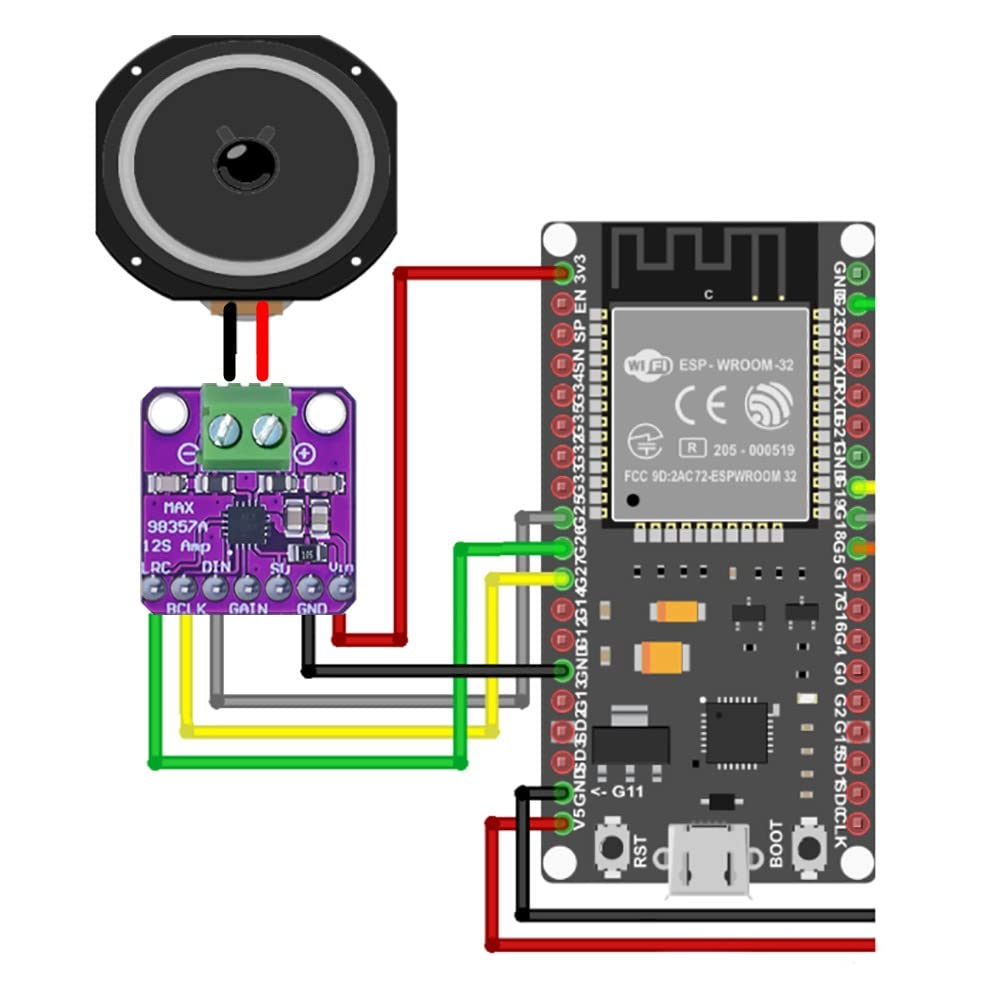

# Android Esp32
<div style="text-align: center;">
    
</div>

so, my target is making an app with connection to esp32 http recieve from http post to control other module that attach to esp32.

## Objective

- i want an assistant ai with sound command without using n8n.
- i want that the ai will reply with speech sound to that will be an output for max98357a module.
- i want that the ai speech sound generate from python code that based on pyttsx3.
- i want that every procces backend run in python code.
- i want that generate .wav file that run on esp32 just one-in-use. like it will be an output sound speech just 1 time before it get deleted from storage

i already make an app that use vosk android demo based (we can call it vadb) to send final text to ai through http post using ai token, so we use this based app.

## Workflow Overview

Mic → vadb → GPT → Android TTS (or cloud TTS)

so it will be complete different this will be complicated.

first, we must now what will be running  
well be using pcm stream via bluetooth A2DP, wifi udp stream and http chunked.  
esp in the other hand will receive pcm stream, feed to max98357 via l2s and command parsing via seperate channel, and it will be btserial

but chaquopy is python embedded, not an server proper so we cant use it inside the app  
we have to run the server in other device  

so idk nvm. we can use termux instead.

## System Layout

### Android
- Vosk Android app (STT) aka vadb
- Termux Python server (GPT + TTS + IoT gateway)

install figlet first :3 then espeak
```bash
pkg install figlet && espeak && mpv 
```
or espeak-ng for modern speak. what? :/ 
you can use gtts, or any. yk its opensource what do i even care.
install the mpv just for fun. i mean, for wav preview yk it have big big size you can just skip download it.
```bash
pkg install espeak-ng
```
nevermind dont use espeak or espeak-ng why do we need offline tts , using ai wasnt even offline. just install the requirement i alaready included gtts there
```bash
pip install -r requirements.txt
```

### ESP32
- attached module like relay, sensor and importand being. max98357A
- receive command + audio

## Main Flow

Mic → Vadb → Final text → HTTP POST ke Termux server

### ah this is shit all make one work fr now
```code
Python gTTS → ffmpeg convert PCM → HTTP chunk stream → ESP32 → I2S DAC
```

### Example Java Code (pseudo)

```java
HttpURLConnection con = (HttpURLConnection) new URL("http://127.0.0.1:5000/stt").openConnection();
con.setRequestMethod("POST");
con.getOutputStream().write(text.getBytes());
````
why my website same as my friend website :O

---

# Termux Setup

## Step 1: Install packages

```bash
chmod +x start.sh
bash start.h
```

```bash
termux-wake-lock
termux-chroot  # optional
```

---


---

## Run Server

```bash
python server.py
```

### Or keep alive using tmux

```bash
pkg install tmux
tmux
python server.py
```

---

# CHANNEL A - COMMAND

## Python

```python
import serial

ser = serial.Serial("/dev/rfcomm0", 115200)

def send_cmd(cmd):
    ser.write((cmd + "\n").encode())
```

## ESP32 C

```c
String cmd = Serial.readStringUntil('\n');
if(cmd == "LIGHT=ON") digitalWrite(RELAY, HIGH);
```

---

# CHANNEL B - AUDIO

```python
from gtts import gTTS
import requests, os
import library.config as config
import subprocess

def speak_stream(text):
    eip = config.EIP
    if not eip:
        print("ESP32 IP not set")
        return
    tts = gTTS(text=text, lang="en")
    tts.save("temp.mp3")

    # ffmpeg convert mp3 to raw PCM stream
    cmd = [
        "ffmpeg", "-i", "temp.mp3",
        "-f", "s16le",
        "-ac", "1",
        "-ar", "22050",
        "-"
    ]

    p = subprocess.Popen(cmd, stdout=subprocess.PIPE)

    def gen():
        while True:
            chunk = p.stdout.read(1024)
            if not chunk:
                break
            yield chunk

    requests.post(f"http://{eip}/audio", data=gen())
speak_stream("Hello house slave")
```

so out.wav will instatly remove after being called.

---

# GPT Command Format

```
SPEECH: hello
CMD:LIGHT=ON
CMD:FAN=0
```

## Python Parser

```python
for line in reply.splitlines():
    if line.startswith("CMD:"):
        send_cmd(line[4:])
```

---

# Multi Process Architecture

we can make all python code in 1 kind of file code. but, it cause some problem, like blocking and it will cause server freezing.
for ideal this should work :

* procces 1 = stt receive server
* procces 2 = ai brain (gpt + parsing)
* procces 3 = tts engine
* procces 4 = esp32 gateway

but for setup this must be done with some effort that im to lazy to do.

---

## Threading Example

```python
import threading

def handle_request(text):
    reply = ask_ai(text)
    threading.Thread(target=speak_and_send, args=(reply,)).start()
    threading.Thread(target=parse_and_send_cmd, args=(reply,)).start()
```

---

# Project Structure

```
ai_home/
 ├ server.py     	# obtain STT from Vosk
 ├ ai_core.py     	# GPT + parsing command
 ├ tts_engine.py 	# TTS + send audio to ESP32
 ├ esp32_gateway.py 	# BT / HTTP to ESP32
 ├ start.sh 
```

server.py is the procces, and other python files was the library

---

# start.sh Script

```bash
#!/data/data/com.termux/files/usr/bin/bash

cd ~/ai_home

# wakelock so android dont kill it randomly
termux-wake-lock

# run server
python server.py &

# optional: log monitor
tail -f nohup.out
```

## Make executable

```bash
chmod +x start.sh
```

## Run

```bash
./start.sh
```

---

# tmux Advanced Script

```bash
#!/bin/bash

termux-wake-lock
tmux new-session -d -s ai

tmux send-keys -t ai "python server.py" C-m
tmux split-window -h
tmux send-keys "python monitor.py" C-m

tmux attach -t ai
```

## And finnaly, the esp32 code
example code, use for reference only
```C
#include <WiFi.h>
#include <WebServer.h>
#include "driver/i2s.h"

WebServer server(80);

void setup_i2s() {
  i2s_config_t cfg = {
    .mode = (i2s_mode_t)(I2S_MODE_MASTER | I2S_MODE_TX),
    .sample_rate = 22050,
    .bits_per_sample = I2S_BITS_PER_SAMPLE_16BIT,
    .channel_format = I2S_CHANNEL_FMT_ONLY_LEFT,
    .communication_format = I2S_COMM_FORMAT_I2S,
    .dma_buf_count = 16,
    .dma_buf_len = 1024
  };
  i2s_driver_install(I2S_NUM_0, &cfg, 0, NULL);
}

void handleAudio() {
  WiFiClient client = server.client();
  uint8_t buf[1024];
  size_t len;

  while (client.connected()) {
    len = client.read(buf, sizeof(buf));
    if (len <= 0) break;

    size_t written;
    i2s_write(I2S_NUM_0, buf, len, &written, portMAX_DELAY);
  }
}

void setup() {
  WiFi.begin("SSID", "PASS");
  setup_i2s();

  server.on("/audio", HTTP_POST, handleAudio);
  server.begin();
}
```
### the esp32 code above is suck, ill try to make the fix one

## Stupid conclusion
| Method         | Complexity | Smooth    | Worth        |
| -------------- | ---------- | --------- | ------------ |
| BT A2DP        | 🟢 easy    | 🟢 smooth | 🟢 BEST      |
| HTTP chunk PCM | 🔥 hard    | 🟡 ok     | 🧠 nerd flex |
| Send WAV file  | bro 🥀💔 | 🔴 lag    | ❌            |

### i said to chatgpt what is the best way to make ts and it told me that my way is stupid

---

```

this all not done yet.
im a kid and my main language wasnt even english, so if my english look so bad dont blame me. hate this language, but dont hate me.
```
